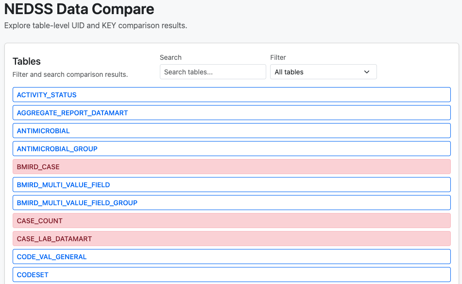
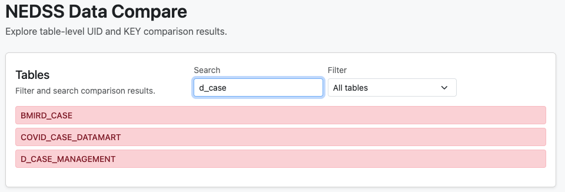
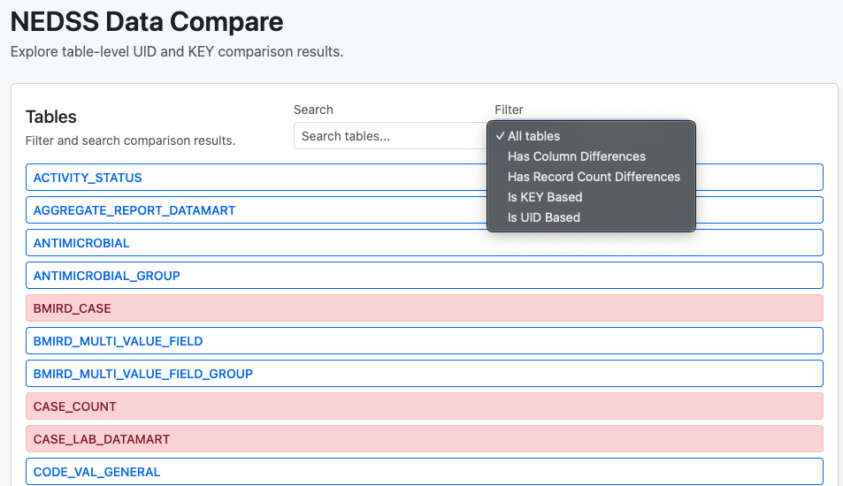
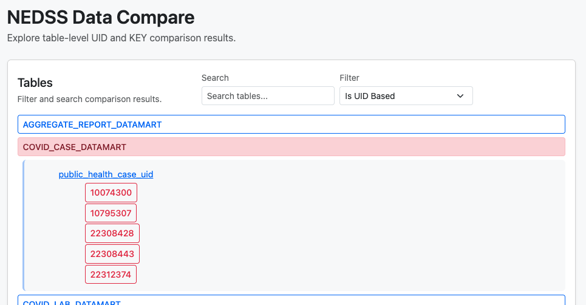
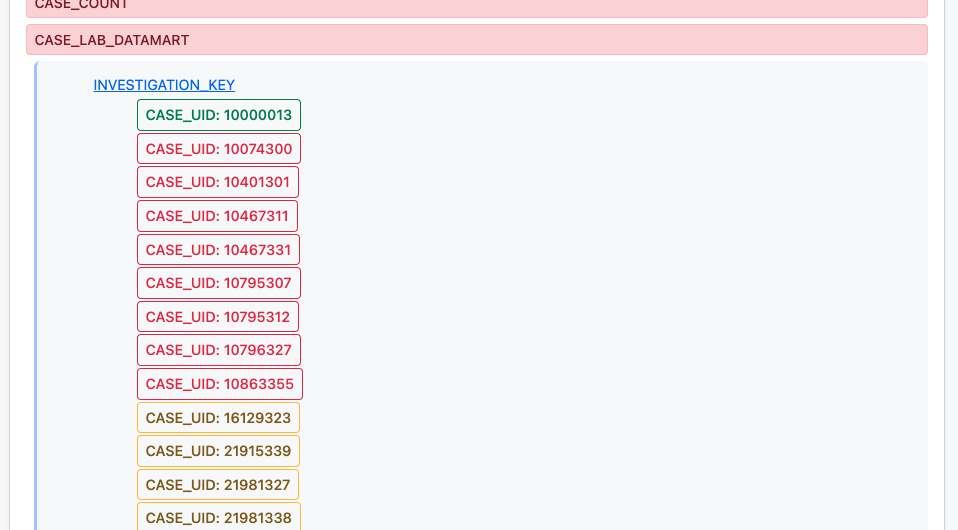
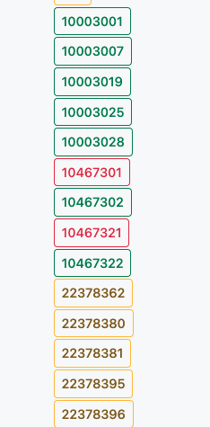
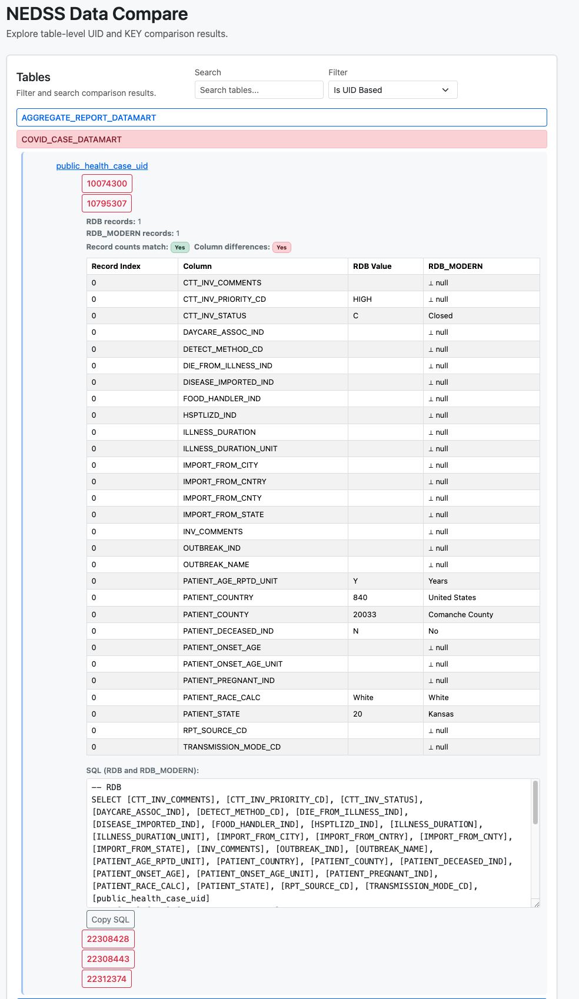
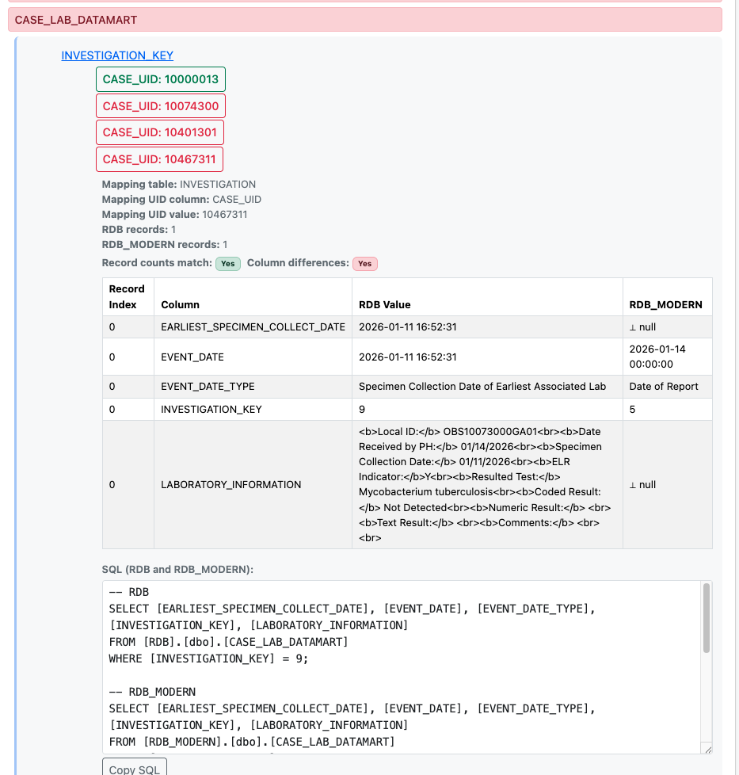

# Setup Instructions

## Prerequisites

### Install Microsoft ODBC Driver for macOS

The ODBC driver is required to connect to SQL Server via pyodbc.

**Option 1: Using Homebrew (Recommended)**

Add Microsoft's Homebrew tap and install:

```bash
brew tap microsoft/mssql-release https://github.com/Microsoft/homebrew-mssql-release
brew install mssql-tools
```

**Option 2: Using Official Microsoft Installer**

Download and install from Microsoft's official source:

```bash
# Install using the official Microsoft script
/bin/bash -c "$(curl https://aka.ms/getodbc/mac)"
```

**Option 3: Verify Installation**

After installation, verify the driver is installed:

```bash
odbcinst -j
```

You should see output showing ODBC driver installations. Look for "ODBC Driver 18 for SQL Server" or "ODBC Driver 17 for SQL Server".

### Verify Python Installation

Ensure Python 3.8 or higher is installed:

```bash
python --version
```

## Installation Steps

### 1. Install Python Dependencies

```bash
python -m pip install -r requirements.txt
```

This installs:
- **pyodbc** — SQL Server ODBC driver for Python
- **sqlalchemy** — ORM and SQL query builder

### 2. Verify Installation

```bash
python -c "import pyodbc; print('pyodbc installed successfully')"
python -c "import sqlalchemy; print('sqlalchemy installed successfully')"
```
## Running The Validator

Validate all tables:
```bash
python main.py
```

Provide target list of tables:
```bash
python main.py --target-tables <my_tables_list.txt>
```

## Running The Results Viewer

### 1. Start The Flask Server

Navigate to the result-reviewer directory and generate the data.js file from validation results:

```bash
cd viewer && python server.py
```


### 2. Open the Web Page

In your browser, visit `http:localhost:8001`


### 3. Using the Results Viewer UI

The viewer web page provides an interactive way to explore UID- and KEY-based comparison results.

The following screenshots live in `python-data-validator-prototype/screenshots` and illustrate the main features:

- **All tables view**  
	  
	Shows the initial landing page with the full list of tables. Each table is rendered as a color-coded button:
	- Light red: table has at least one column difference.
	- Light yellow: table has only record-count mismatches.
	- Default outline blue: table has no known differences.

- **Search tables**  
	  
	Demonstrates the search box in the header. As you type, the table list is filtered in real time (case-insensitive) so you can quickly locate a specific table.

- **Filter tables**  
	  
	Shows the filter drop-down next to the search box. This lets you restrict the list to:
	- *Has Column Differences* – only tables with at least one differing column.
	- *Has Record Count Differences* – only tables with at least one record-count mismatch.
	- *Is KEY Based* – tables that only have `key_validation`.
	- *Is UID Based* – tables that only have `uid_validation`.

- **UID-based table navigation**  
	  
	Example of expanding a UID-based table. Clicking a table button reveals its UID columns; clicking a UID column shows the list of UID values. Each UID value appears as a small status-colored button.

- **KEY-based table navigation**  
	  
	Example of expanding a KEY-based table. Clicking a table button reveals KEY columns; clicking a KEY column shows mapping UIDs (from the mapping table) as buttons, which you can drill into to see details.

- **UID / mapping UID button color coding**  
	  
	Illustrates the per-UID (and per-mapping-UID) button colors:
	- Green: no column differences and record counts match.
	- Yellow: record-count mismatch only (no column differences).
	- Red: one or more column differences.
	- Disabled grey: no comparison data available for that UID/mapping UID.

- **Column differences for UID-based tables**  
	  
	Shows the details panel that appears when you click a red UID button for a UID-based table. It includes:
	- A human-readable summary of RDB vs RDB_MODERN record counts and whether counts and columns differ.
	- A modern Bootstrap-styled table listing per-record, per-column differences.
	- A SQL section with copyable queries for reproducing the discrepancy in both `RDB` and `RDB_MODERN`.

- **Column differences for KEY-based tables**  
	  
	Shows the details panel for a red mapping UID button on a KEY-based table. In addition to the record-count and column-differences summary, it displays:
	- The mapping table name and mapping UID column/value.
	- Column differences between `RDB` and `RDB_MODERN`.
	- SQL to query the affected KEY table in both databases and additional `SELECT *` statements against the mapping table for that mapping UID.


## Troubleshooting
### ODBC Driver Not Found

If you get "ODBC Driver 18 for SQL Server not found", verify installation:

```bash
odbcinst -j
```

### Connection Timeout

Ensure your SQL Server is accessible and firewall allows the connection (default port 1433).

### Authentication Errors

Verify username, password, and server name. Test with SQL Server Management Studio first if available.
