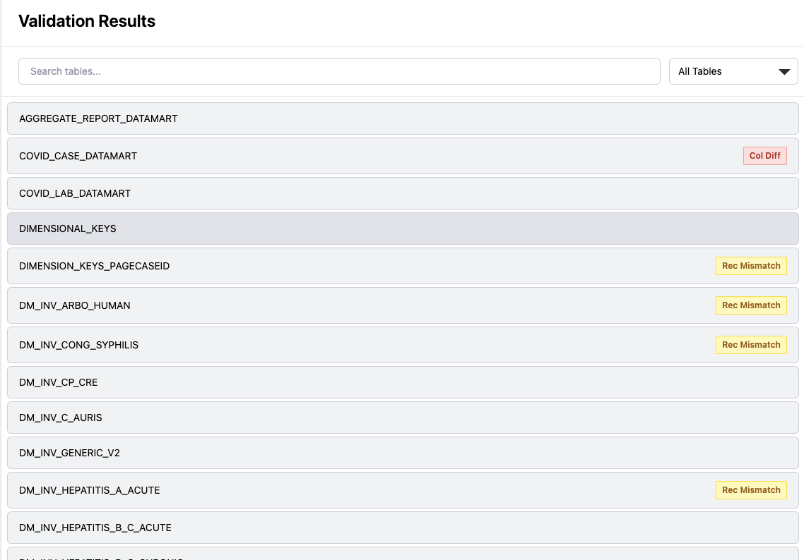
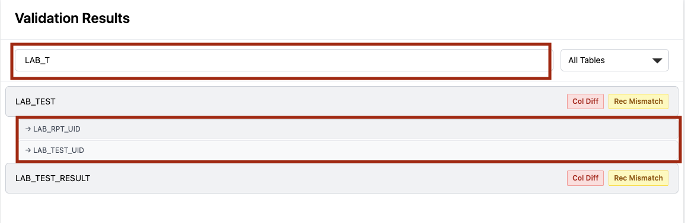
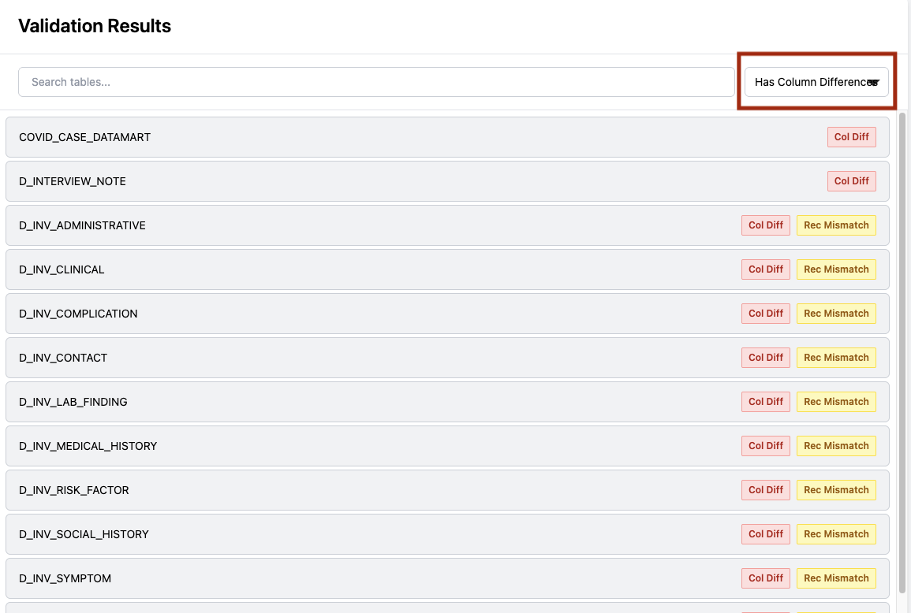
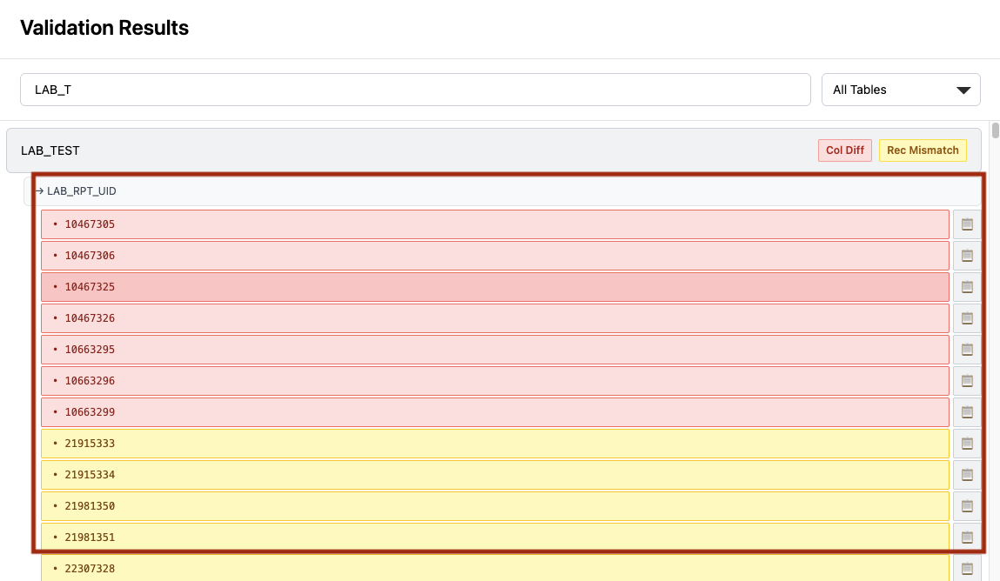
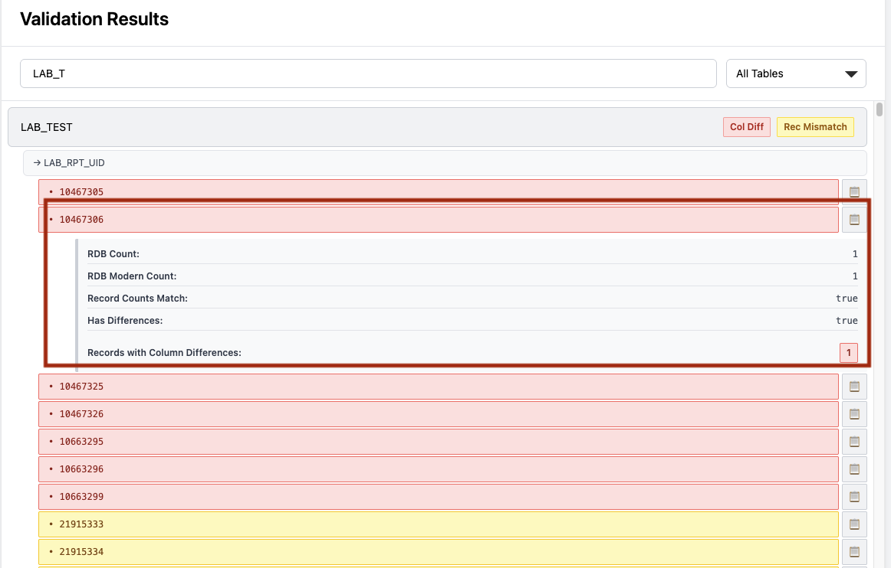
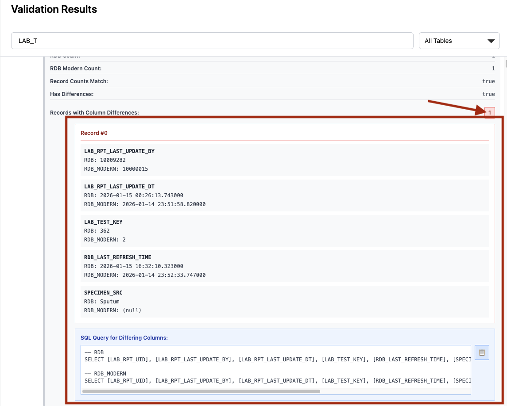

# Setup Instructions

## Prerequisites

### Install Microsoft ODBC Driver for macOS

The ODBC driver is required to connect to SQL Server via pyodbc.

**Option 1: Using Homebrew (Recommended)**

Add Microsoft's Homebrew tap and install:

```bash
brew tap microsoft/mssql-release https://github.com/Microsoft/homebrew-mssql-release
brew install mssql-tools
```

**Option 2: Using Official Microsoft Installer**

Download and install from Microsoft's official source:

```bash
# Install using the official Microsoft script
/bin/bash -c "$(curl https://aka.ms/getodbc/mac)"
```

**Option 3: Verify Installation**

After installation, verify the driver is installed:

```bash
odbcinst -j
```

You should see output showing ODBC driver installations. Look for "ODBC Driver 18 for SQL Server" or "ODBC Driver 17 for SQL Server".

### Verify Python Installation

Ensure Python 3.8 or higher is installed:

```bash
python --version
```

## Installation Steps

### 1. Install Python Dependencies

```bash
python -m pip install -r requirements.txt
```

This installs:
- **pyodbc** — SQL Server ODBC driver for Python
- **sqlalchemy** — ORM and SQL query builder

### 2. Verify Installation

```bash
python -c "import pyodbc; print('pyodbc installed successfully')"
python -c "import sqlalchemy; print('sqlalchemy installed successfully')"
```
## Running The Validator

Validate all tables:
```bash
python main.py
```

Provide target list of tables:
```bash
python main.py --target-tables <my_tables_list.txt>
```

## Running The Results Viewer

### 1. Generate Results Viewer Data JS

Navigate to the result-reviewer directory and generate the data.js file from validation results:

```bash
cd result-reviewer
python generate_viewer_data.py
```

This will load all 297 tables from the `results/` directory and generate a `data.js` file containing all validation data.

### 2. Open viewer.js

Open `index.html` in your web browser to view the validation results.

## How to Use

The Results Viewer provides an interactive interface to explore database validation results. Below are the key features and how to use them.

### Full Table List View


When you first open the viewer, you'll see the complete list of all validated tables. Each table row shows:
- **Table name** (left)
- **Status badges**: 
  - "Col Diff" (red) — indicates tables with column differences
  - "Rec Mismatch" (yellow) — indicates tables with record count mismatches

Tables with no issues are shown without badges.

### Search Functionality


Use the search bar at the top to filter tables by name. The search is case-insensitive and matches any part of the table name. As you type, the table list updates in real-time to show only matching results.

### Filter by Status


The dropdown filter allows you to view tables by specific issue types:
- **All Tables** — shows all validated tables
- **Has Column Differences** — shows only tables where columns differ between RDB and RDB_MODERN
- **Record Count Mismatch** — shows only tables where record counts don't match

### Expand UID Column


Click on a table name to expand it and view its UID (unique identifier) columns. Each UID column is listed with an arrow (→) indicator. The viewer will show all distinct UID columns found in that table.

### Expand UID Values


Click on a UID column to expand and see all the individual UID values. Each UID value row shows:
- **UID value** (or "(null)" for null values)
- **Status color**:
  - Green — records match perfectly between databases
  - Red — records have column differences
  - Yellow — record counts don't match
- **Copy button** (📋) — click to copy the UID value to your clipboard

### View Comparison Details
Click on a UID value to expand and see detailed comparison information:
- **RDB Count** — number of matching records in the RDB database
- **RDB Modern Count** — number of matching records in the RDB_MODERN database
- **Record Counts Match** — boolean showing if counts are identical
- **Has Differences** — boolean indicating if any column values differ
- **Records with Column Differences** — a button showing the count of records with differing columns

### Inspect Column Differences


Click on the "Records with Column Differences" count button to expand and see:
- **Record Index** — which record in the result set has differences
- **Column Details** — for each differing column:
  - Column name
  - Value from RDB database
  - Value from RDB_MODERN database

### Query Differing Columns
Below the column differences list, a SQL query snippet is provided:
- Shows both RDB and RDB_MODERN queries
- Includes the UID column and all columns with differences
- Uses fully qualified table names with database and schema
- **Copy button** (📋) — click to copy the complete SQL snippet to your clipboard for manual investigation in SQL Server Management Studio

### Copy to Clipboard
Any text element with a 📋 button can be copied. After clicking, the button temporarily changes to ✓ and turns green to confirm the copy was successful.
## Troubleshooting

### ODBC Driver Not Found

If you get "ODBC Driver 18 for SQL Server not found", verify installation:

```bash
odbcinst -j
```

### Connection Timeout

Ensure your SQL Server is accessible and firewall allows the connection (default port 1433).

### Authentication Errors

Verify username, password, and server name. Test with SQL Server Management Studio first if available.
